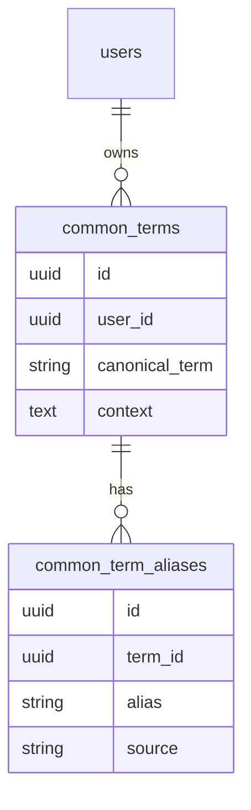

# Common Terms

Domain vocabulary that helps Rippled understand the language used in your meetings, emails, and transcripts.

---

## What It Is

Common Terms is a user-defined glossary that maps informal or ambiguous language to canonical meanings. It serves two purposes:

1. **Alias resolution** — multiple names or shorthand terms that refer to the same thing get resolved to a single canonical value
2. **Context injection** — when processing transcripts or emails, Rippled injects the relevant terminology as context into the LLM prompt, improving accuracy of commitment detection and owner resolution

---

## Use Cases

### Name aliases
People are referred to inconsistently across meetings and messages. Common Terms handles this:

| Aliases | Canonical | Context |
|---------|-----------|---------|
| Eillyne, Eilynne, Ayleen | Eilynne Belisario | EA and Marketing Support on Mitch's team |
| Mitch, Mich | Mitch | Operations/Marketing Lead at Kevlex Academy |

### Tool / product aliases
Internal shorthand for products or platforms:

| Aliases | Canonical | Context |
|---------|-----------|---------|
| Hatch, GHL | GoHighLevel | CRM platform used by KRS |

---

## Data Model

Two tables power this feature:

### `common_terms`
The canonical record — one row per unique concept.

| Column | Type | Description |
|--------|------|-------------|
| `id` | UUID | Primary key |
| `user_id` | UUID | Owner (scoped per user) |
| `canonical_term` | string | The authoritative name (e.g. "GoHighLevel") |
| `context` | text | One sentence explaining what this term means in context |
| `created_at` / `updated_at` | timestamp | Audit fields |

### `common_term_aliases`
One row per alternate name that maps to a canonical term.

| Column | Type | Description |
|--------|------|-------------|
| `id` | UUID | Primary key |
| `term_id` | UUID | Foreign key → `common_terms.id` |
| `alias` | string | The alternate name (e.g. "Hatch", "GHL") |
| `source` | string | How this alias was added (`manual` or `extracted`) |

Multiple aliases can map to the same canonical term. The canonical term itself is also searchable — you don't need to add it as its own alias.



---

## How Resolution Works

The `term_resolver` service scans text for any known alias (or canonical term):

- **Short aliases (< 4 chars):** whole-word match only, to avoid false positives (e.g. "GHL" won't match "CGHL")
- **Longer aliases:** case-insensitive substring match

When a match is found, it returns:

```json
{
  "alias": "Hatch",
  "canonical": "GoHighLevel",
  "context": "GoHighLevel is the CRM platform used by KRS."
}
```

This is assembled into a **Terminology Context block** that gets prepended to LLM prompts before seed detection and commitment analysis:

```
## Terminology Context
- "GoHighLevel" (also known as: Hatch, GHL): GoHighLevel is the CRM platform used by KRS.
- "Eilynne Belisario" (also known as: Eillyne, Eilynne, Ayleen): EA and Marketing Support on Mitch's team.
```

---

## Current Interface

Terms are managed via the **Settings → Identity** section in the Rippled admin UI. The interface presents a table with columns: **Term**, **Aliases**, and **Context**.

Voice-based onboarding (recording sessions to extract terms automatically) is a planned future path — not the current default.

---

## Future: Automatic Term Extraction

The `source` field on `common_term_aliases` supports `extracted` as a value. This is reserved for a future pipeline where Rippled auto-detects recurring name variations and tool references from ingested content, then surfaces them for user confirmation.

Until that's built, all terms are added manually.

---

## Related

- [Identity Resolution](../architecture/data-model.md) — how `user_identity_profiles` resolves commitment owners
- [Signal Pipeline](signal-pipeline.md) — where term context is injected during detection
- [Data Model](data-model.md) — full schema overview
