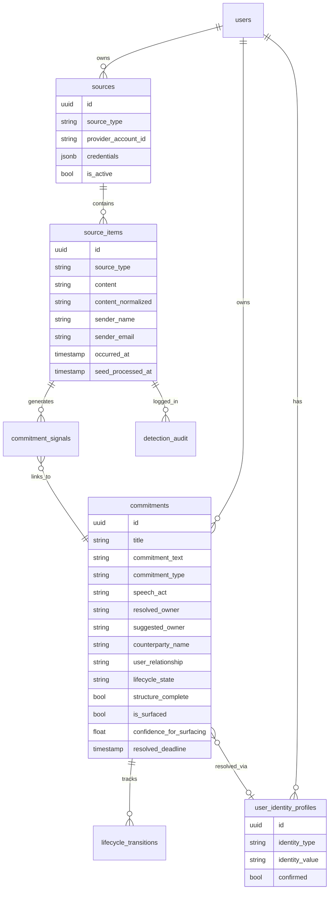

# Data Model

Core tables and their relationships in Rippled's PostgreSQL database.

---

## Entity Relationships



---

## Key Tables

### `source_items`
Raw ingested content from all sources. One row per email, Slack message, or meeting transcript. The source of truth — never modified after creation.

### `commitments`
Extracted commitment objects. Created by the detection pipeline. Updated by lifecycle events and user actions.

### `commitment_signals`
The join table between `source_items` and `commitments`. Tracks which source items contributed evidence to which commitment, and what role each signal played (origin, clarification, delivery, closure).

### `detection_audit`
Every LLM detection call logged with: raw prompt, raw response, parsed result, tokens, cost, duration, prompt version. Essential for debugging and eval.

### `user_identity_profiles`
Maps a user's known names and email addresses to their `user_id`. Powers owner resolution — when the LLM extracts "Kevin" as the owner, this table resolves it to a user UUID.

### `lifecycle_transitions`
Immutable log of every state change on a commitment, with timestamp and trigger reason.

---

## Lifecycle State Enum

```
proposed → needs_clarification | active | discarded
active / confirmed → in_progress | delivered | dormant | discarded
in_progress → delivered | canceled | dormant
delivered → completed | closed | active (reopened)
completed → closed
canceled → closed
dormant → active | discarded
closed → active (reopened)
```

See [Commitment Lifecycle](lifecycle.md) for the full state machine.
