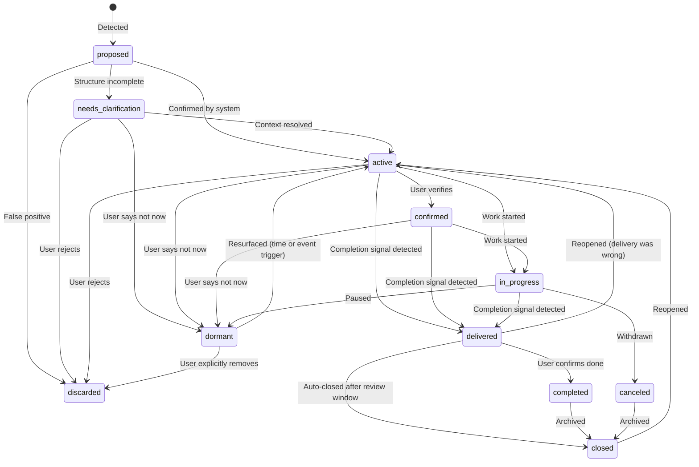

# Commitment Lifecycle

The full state machine for a commitment object — from detection to closure.

---

## State Diagram

---

## State Definitions

| State | Meaning | Surfaces? |
|-------|---------|-----------|
| `proposed` | Detected, not yet reviewed | No |
| `needs_clarification` | Too ambiguous to surface | No |
| `active` | Open, confirmed commitment | Yes |
| `confirmed` | User-verified active | Yes |
| `in_progress` | Work underway | Yes |
| `dormant` | Not now — tracked silently | No |
| `delivered` | System detected completion | No (shown in history) |
| `completed` | User confirmed done | No |
| `canceled` | Withdrawn or declined | No |
| `closed` | No longer needs attention | No |
| `discarded` | Wrong extraction / noise | No |

---

## Key Distinctions

**delivered vs completed vs closed**

- `delivered` = the thing was sent/done — system detected this from a completion signal
- `completed` = user confirmed it's fully done — requires human signal
- `closed` = no longer needs attention — covers completed + canceled + staleness

**active vs confirmed**

- `active` = system believes this is a real open commitment
- `confirmed` = user has explicitly verified this is real

**dormant vs discarded**

- `dormant` = "not now" — the commitment is real but not relevant right now. Will resurface.
- `discarded` = "wrong" — this was never a real commitment or is pure noise. Never resurfaces.

---

## Resurfacing Triggers for Dormant Commitments

A `dormant` commitment resurfaces when:

1. **Time-based** — X days have passed since it was marked dormant (default: 7 days)
2. **Event-based** — a related commitment was completed ("you said you'd do X after Y — Y is done")
3. **Manual** — user explicitly reviews dormant list and reactivates

---

## Completion Detection

When a new signal arrives that looks like evidence of delivery (`speech_act=completion`), the completion service:

1. Searches for open commitments in the same thread (strong match)
2. Searches for semantically similar open commitments (medium match)
3. Scores evidence strength (strong / medium / weak)
4. Transitions matched commitment to `delivered`
5. Flags for user confirmation → `completed`

Source: `app/services/completion/`
