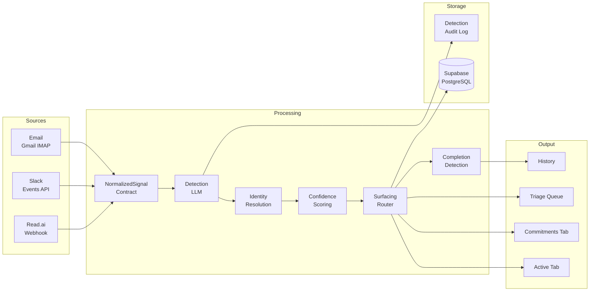

# Architecture Overview

Rippled is built around a single shared commitment engine that processes signals from email, Slack, and meetings through a staged pipeline.

---

## System Map

---

## Stack

| Layer | Technology |
|-------|-----------|
| Backend | FastAPI (Python) |
| Database | PostgreSQL via Supabase |
| Task queue | Celery + Redis |
| Deployment | Railway |
| Detection LLM | Anthropic Claude (Sonnet via subscription) |
| Email | Gmail IMAP poller |
| Meetings | Read.ai webhook |
| Slack | Events API webhook |
| Frontend | React |

---

## Key Design Principles

**LLMs interpret language. Deterministic logic controls everything else.**

The LLM's job is semantic interpretation: is this a commitment, who owns it, what was promised? The application layer controls lifecycle transitions, confidence thresholds, surfacing rules, and merge/update/create decisions. This separation is critical for trust and consistency.

**Detect more than you surface.**

The system captures everything it can. Surfacing is selective. This means false negatives in the UI are recoverable — the data is there, just not shown. False positives in the UI are what damage trust.

**One shared engine, source-specific behaviour.**

Email, Slack, and meetings feed the same pipeline. Source-specific rules shape extraction and confidence but never diverge on lifecycle or outcome types.

**Incomplete is a valid state.**

A commitment without a clear owner or deadline is still worth tracking. The system captures partial information, marks fields as uncertain, and waits for more context rather than discarding ambiguous signals.
