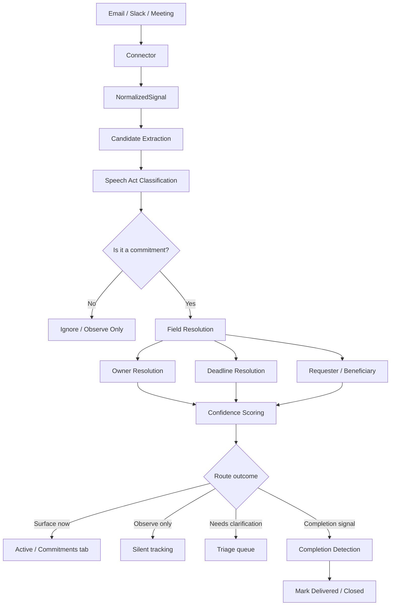

# Signal Pipeline

How a raw email, Slack message, or meeting transcript becomes a commitment object.

---

## Overview



---

## Stage 1: Ingest

Each source has a connector:

| Source | Connector | Status |
|--------|-----------|--------|
| Email | IMAP poller (`connectors/email/`) | ✅ Live |
| Slack | Events API webhook (`connectors/slack/`) | ✅ Connected |
| Meetings | Read.ai webhook + normalizer (`connectors/meeting/`) | ✅ Connected |
| Calendar | Google Calendar | 🔄 Partial |

---

## Stage 2: NormalizedSignal

**Status:** 📋 Queued (WO-2)

Every connector must output a `NormalizedSignal` before hitting detection. This is an in-memory contract — not a DB model.

```python
@dataclass
class NormalizedSignal:
    signal_id: str
    source_type: str              # email | slack | meeting
    source_thread_id: str | None
    actor_participants: list      # who authored/spoke
    addressed_participants: list  # direct recipients
    visible_participants: list    # all in context
    latest_authored_text: str     # ONLY the current block, no quoted history
    prior_context_text: str | None  # quoted history — for linking only, NOT detection
    occurred_at: datetime
    authored_at: datetime
    attachments: list
    links: list
    metadata: dict
```

!!! warning "Key rule"
    `latest_authored_text` must never contain quoted email history. Quoted text goes into `prior_context_text` and is used only for linking to existing commitments — never for creating new ones.

---

## Stage 3: Candidate Extraction

The detection LLM receives `latest_authored_text` plus bounded `prior_context_text` (clearly labelled). It extracts **commitment candidates** — not final truth.

One signal may produce zero, one, or multiple candidates.

**Current prompt version:** `ongoing-v4` → [View prompt](../prompts/detection-v4.md)

---

## Stage 4: Speech Act Classification

**Status:** 📋 Queued (WO-4)

Each candidate is classified by what the speaker is doing:

| Speech Act | Meaning |
|-----------|---------|
| `self_commitment` | Speaker commits to doing something |
| `request` | Speaker asks someone else to do something |
| `acceptance` | Speaker accepts ownership of a request |
| `completion` | Speaker signals delivery or done |
| `status_update` | Progress report, no new obligation |
| `cancellation` | Withdrawing a prior commitment |
| `decline` | Refusing a request |
| `reassignment` | Transferring ownership |
| `informational` | No commitment content |

!!! info "Why this matters"
    A `request` that was never accepted should not surface as *your* commitment. Currently the system can't distinguish these — WO-4 fixes this.

---

## Stage 5: Field Resolution

For each candidate with `speech_act = self_commitment | acceptance | request`:

- **Owner** — who is accountable for delivery
- **Requester** — who asked for it (WO-5)
- **Beneficiary** — who ultimately benefits (WO-5)
- **Deliverable** — what was promised
- **Deadline** — when (explicit or inferred)

Owner is resolved against the [User Identity Profiles](../product/domain-policy.md#identity) system.

---

## Stage 6: Confidence Scoring

Six separate confidence scores:

| Score | Meaning |
|-------|---------|
| `confidence_commitment` | Is this actually a commitment? |
| `confidence_owner` | Is the owner correctly identified? |
| `confidence_deadline` | Is the deadline accurate? |
| `confidence_delivery` | Has delivery evidence been detected? |
| `confidence_closure` | Is the commitment resolved? |
| `confidence_actionability` | Should this surface to the user? |

Combined into `confidence_for_surfacing` as the single routing decision point.

---

## Stage 7: Route Outcome

| Outcome | Condition |
|---------|-----------|
| Surface in Active | `user_relationship=mine`, high confidence, `structure_complete=true` |
| Surface in Commitments | `user_relationship=mine/contributing`, medium confidence |
| Observe silently | Low confidence, or `user_relationship=watching` |
| Hold for triage | `structure_complete=false`, owner missing |
| Completion detection | `speech_act=completion` |
| Ignore | `speech_act=informational/decline` |
